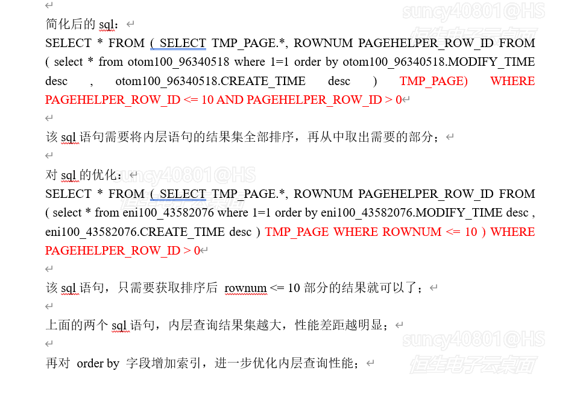
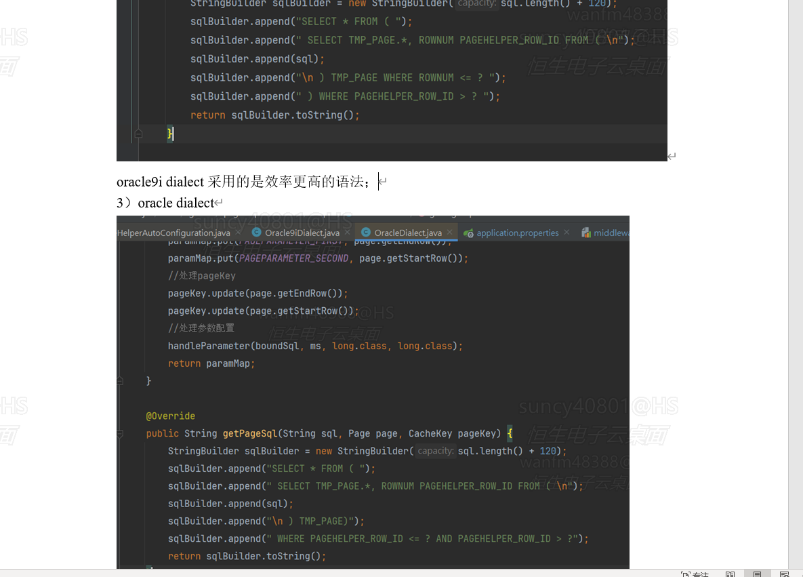

## pagehelper两种方言的源码：

从图片中的代码来看，这两种查询方式的性能差异主要与以下因素有关：

1. **分页查询的实现方式**：
    - 第一种方式（Oracle 9i dialect）通过嵌套子查询的方式进行分页，使用 `ROWNUM` 来限制结果集。这种方式直接对原始查询进行包装，生成一个临时表（
      `TMP_PAGE`），然后在外层查询中应用 `ROWNUM` 范围过滤条件。
    - 第二种方式（标准 Oracle dialect）使用普通的查询，但对分页参数进行额外的逻辑处理。这种方式可能导致额外的解析、绑定操作。

2. **Oracle 对 ROWNUM 的优化**：
    - Oracle 的 `ROWNUM` 在执行计划中可以非常高效地限制结果集大小，尤其是小范围的分页查询。这使得 `ROWNUM` 在实际执行中性能更优。
    - 如果直接对原始 SQL 应用分页逻辑，可能会导致更复杂的执行计划，特别是当查询中有多个表或较复杂的子查询时。

3. **临时表的引入**：
    - Oracle 9i dialect 使用了临时表 `TMP_PAGE`，这种做法在逻辑上是将分页逻辑与实际业务查询分离，便于优化执行计划。
    - 如果没有引入临时表，分页参数会直接影响原始查询逻辑，可能导致优化器生成的执行计划较差。

4. **PageHelper 处理逻辑**：
    - 如果 PageHelper 对 `getPageSql` 方法生成的 SQL 缓存或绑定处理方式不同，也会影响性能。例如：
        - 是否复用了绑定变量？
        - 是否优化了参数映射逻辑？
        - 是否对生成的 SQL 进行了二次解析？

**总结**：
Oracle 9i dialect 的实现利用了 `ROWNUM` 和临时表的高效性，可能比标准实现更快。性能差异来源于查询的复杂度和执行计划的优化情况。你可以通过执行计划（
`EXPLAIN PLAN`）分析这两种 SQL 的实际性能差异，找出瓶颈点。